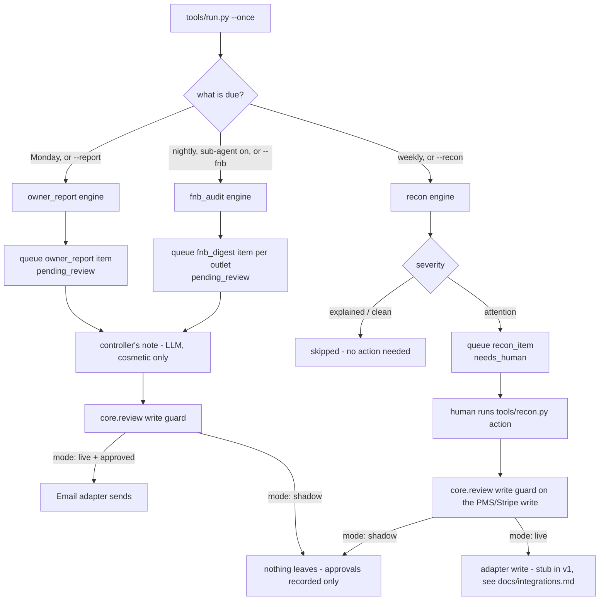

# Reporting & Audit AI — "The Auditor"

Two siblings.

## What it does

Two siblings. Weekly Report aggregates revenue (PMS), web traffic (GA4), and expenses into a one-page email to owners every Monday. Weekly Income Audit reconciles PMS reservations against the finances sheet and flags mismatches.

**What it won't do.** Reports and flags; never edits the books or the PMS itself.

**Why it matters.** Owners get a true weekly pulse without anyone building a deck, and revenue leakage gets caught while it's still fixable.

**What to expect.** Replaces hours of weekly reporting; catches booking↔ledger mismatches across a rolling 120-day window.

That last line is the roster's own promise, and this template is upfront
about where it differs from the built engine underneath it: the
reconciliation you get here is a **7-day, three-way** check (bank, Stripe
and the PMS folio, not a two-way check against a finances sheet over 120
days). See `docs/how-it-works.md` → "Design decisions" #1 for exactly why,
and how to widen the window if you want to.

This repo also folds in a sub-agent, **F&B Sales Audit AI ("the Pit
Boss")**, off by default — see [§12](#sub-agents-in-this-repo).

## Who it's for

- **Independent hotels and small groups** whose owners want a weekly number
  without anyone building a deck for it — the report is one page, not a
  dashboard nobody opens.
- **Any property with a PMS, a bank account and Stripe** (or a payment
  processor whose export looks similar) — the reconciliation logic does not
  need a restaurant, a specific PMS brand, or a specific accounting package.
  Everything arrives as CSV, so it works with whatever you already export.
  See [§8](#connect-your-systems).
- **Hotels with a restaurant** who also want the daily till audit — turn on
  the F&B Sales Audit sub-agent once you have a POS export.
- **Replaces:** the hour or two someone spends every Monday pulling numbers
  from three places into a deck, and the ad-hoc "does the bank match the
  PMS" check that usually only happens when something already looks wrong.
- **Not for:** a hotel that wants the agent to actually post to the ledger
  or take a payment on its own. It never does — see [§11](#guardrails--safety).

## How it works



**Deterministic decisioning, LLM for language.** Every number in the report
and every reconciliation verdict is arithmetic over real rows — the model
is asked for exactly one thing, a 3-4 sentence closing note, and that note
never changes what the report says or what gets flagged. See
`docs/how-it-works.md` for the formulas and the seven-step reconciliation
design.

**The two modes.**

| Mode | What happens |
|---|---|
| `shadow` (default) | Every report and digest is drafted and queued, never sent. Every reconciliation action is recorded but nothing reaches the PMS or Stripe. |
| `live` | An **approved** item is actually sent or applied the next time you run the send/action command. Everything else still waits. |

**The review loop.** A report or digest queues as `pending_review`; a
reconciliation exception that needs a person queues as `needs_human`.
`python3 tools/review.py list` shows both. Communications are approved,
edited or rejected and then sent; reconciliation exceptions get one of five
actions applied instead — see [§9](#run-it).

**What runs when.**

| Job | Cadence (default) | Config key | Provider |
|---|---|---|---|
| Weekly Owner Report | Monday, weekly | `schedule.owner_report` | LLM only for the cosmetic note |
| Weekly Income Audit | weekly | `schedule.income_audit` | none — fully deterministic |
| F&B Sales Audit (sub-agent, off by default) | nightly | `schedule.fnb_audit` | LLM only for the cosmetic note |

`make schedule ARGS="--all"` prints a cron/launchd/systemd snippet for every
job at once — see [§9](#run-it).

## What you need

- **A daily revenue/cost export** from wherever your finance team already
  tracks it (a spreadsheet export is fine) — for the Weekly Owner Report.
  `docs/integrations.md` names the exact columns.
- **A bank statement export, a Stripe (or similar) payments export, and a
  PMS folio-charges export** — for the Weekly Income Audit. The bank one is
  usually the fiddly one if your bank only offers a PDF; see
  `docs/integrations.md`.
- **A mailbox** to send from (or use the mock adapter and read
  `data/exports/sent_email.jsonl` while you are testing).
- **A Claude Code subscription** (what you are reading this in) or your own
  `ANTHROPIC_API_KEY` — only used for one cosmetic sentence per run, so
  either is plenty.
- **If you turn on the F&B Sales Audit sub-agent:** a POS export with
  units/revenue/covers per item per day, and each outlet manager's email.
- **Time:** 5 minutes for the quick start below, no credentials. 20-30
  minutes to connect your first real CSV export and see a real report.

## Quick start (5 minutes, no credentials)

```bash
git clone https://github.com/th1-ai/reporting-audit-ai.git reporting-audit-ai
cd reporting-audit-ai
make setup
make demo
```

`make setup` creates a virtualenv, installs dependencies, and copies
`.env.example` → `.env` and every `config/*.example.yaml` →
`config/*.yaml`. `make demo` seeds the bundled fixtures (an invented
property, "Hotel Aurora") and runs all three jobs. You should see something
like this (exact figures come from the fixtures, not hand-typed):

```
Seeded fixtures:
  fin_daily: 14 row(s)
  fin_bank_lines: 7 row(s)
  fin_stripe_payments: 9 row(s)
  fin_pms_charges: 7 row(s)
  pos_sales_daily: 70 row(s)
  pos_items: 5 row(s)

Weekly Owner Report: drafted, queued for review.

7 of 13 reconciled - 6 need(s) a human - 3,285.00 in question

F&B Sales Audit: 1 digest(s) queued for review (forced on for the demo).

Review queue:
  needs_human: 6
  pending_review: 2
  skipped: 7

8 item(s) waiting on a human. Run `make review ARGS="--demo"` to see them
(this demo always runs in its own database, data/demo/demo.db - your real
queue in data/agent.db is untouched; plain `make review` works that one).

3 items processed, 2 drafted, 0 sent (shadow)
DEMO OK
```

Nothing was sent anywhere — `mode: shadow` is the default and `make demo`
never changes it. Look at what got queued — `--demo` reads the database
`make demo` just wrote, not your real queue:

```bash
make review ARGS="--demo"
python3 tools/review.py show <id> --demo
```

## Set up with Claude Code

Open `claude` in this folder for each phase below and paste the prompt.
Each one names the workflow file Claude will follow, so you can read ahead
if you want to.

**Phase 1 — first run.**

> Read `workflows/00-setup.md` and walk me through it. I want to see
> `make demo` work before we touch any real data.

**Phase 2 — the property and the signature.**

> Follow the "Fill in the property" and "Set who reads the reports" steps
> in `workflows/00-setup.md`. Ask me for the hotel's name, address,
> currency, the owner emails, and the sign-off for outgoing reports.

**Phase 3 — connect your first real data source.**

> Read `docs/integrations.md`. I have a [daily revenue export / bank
> statement / Stripe export / PMS charges export] — help me get it into the
> right CSV shape and saved to the right `data/imports/` file, then run
> `make doctor` to confirm it is picked up.

`make demo` (above) always runs in its own database and never touches your
real queue, so there is nothing to reset before this step. If this working
copy is old enough to have run `make demo` before that isolation shipped,
run `make clean` first — it deletes all local runtime state (the database,
logs, exports) and leaves `.env`/`config/` untouched — so nothing left over
from that earlier demo can mix into the real data you connect now.

**Phase 4 — run it for real.**

> Follow `workflows/10-owner-report.md` (or `workflows/15-income-audit.md`)
> to run the job against my real data, then walk me through
> `workflows/80-review.md` to review what it produced.

**Phase 5 — the restaurant, if you have one.**

> Follow `workflows/20-fnb-sales-audit.md` to turn on the F&B Sales Audit
> sub-agent and connect a POS export.

**Phase 6 — go live.**

> Read `workflows/90-go-live.md` and tell me honestly whether we are ready.
> Do not flip `mode` to `live` until you have walked me through the
> checklist and I have said yes.

## Connect your systems

Full detail, exact CSV columns and the "implement your own" recipe live in
`docs/integrations.md`. Short version:

| System | Adapter | Status | Needs |
|---|---|---|---|
| Owner report source | `data/imports/financial_daily.csv` | universal | a daily revenue/cost export |
| Web traffic (optional) | `data/imports/web_traffic.csv` | universal | a GA4/Ads export, or none — the report says so honestly |
| Bank statement | `data/imports/bank_statement.csv` | universal | your bank's export (OCR the PDF first if that is all you have) |
| Payments | `data/imports/stripe_payments.csv` | universal | a Stripe (or similar) export |
| PMS folio charges | `data/imports/pms_charges.csv` | universal | a PMS export |
| Email — `systems.email.adapter` | `mock` / `imap` / `gmail` | universal / universal / built | a mailbox, or nothing to test with `mock` |
| PMS write (the `post_folio` action only) | `mock` / `csv` / `cloudbeds` | universal / universal / built | nothing / nothing / OAuth app |
| Payments write (`link_customer`, `refund_duplicate`, `charge_balance`) | stub | stub | a Stripe adapter — see the "Implement your own" section of `docs/integrations.md` |
| POS till feed (sub-agent) | `data/imports/pos_sales_daily.csv` | universal | a POS export |

Test any of it:

```bash
make doctor
```

`mock` is what `make demo` uses and needs nothing. The CSV path is where
every hotel starts — it works with any PMS, any bank, any payment
processor. The three writing reconciliation actions (`link_customer`,
`refund_duplicate`, `charge_balance`) are honestly a **stub** in this
template until you connect a real Payments adapter; `post_folio` already
works today against the `mock`/`csv`/`cloudbeds` PMS adapters, logging what
it would do when it cannot really write.

## Run it

```bash
python3 tools/run.py --once            # whatever is due, per config/agent.yaml: schedule:
python3 tools/run.py --once --report   # force the weekly owner report
python3 tools/run.py --once --recon    # force the income audit
python3 tools/run.py --once --fnb      # force the F&B sales audit (if enabled)
python3 tools/run.py --once --dry-run  # compute everything, no business data written
python3 tools/run.py --watch           # loop on poll_seconds (default 3600s)
```

**The review queue.**

```bash
python3 tools/review.py list                              # everything waiting
python3 tools/review.py list --kind owner_report
python3 tools/review.py list --kind recon_item --status needs_human
python3 tools/review.py show <id>
python3 tools/review.py approve <id>
python3 tools/review.py edit <id> --body-file my-version.txt
python3 tools/review.py reject <id> --reason "..."
python3 tools/review.py send                              # email approved reports/digests
```

**Reconciliation actions** are separate from the send queue — a
reconciliation exception has no message to send, only a fix to apply:

```bash
python3 tools/recon.py action <id> link_customer
python3 tools/recon.py action <id> post_folio
python3 tools/recon.py action <id> refund_duplicate
python3 tools/recon.py action <id> charge_balance
python3 tools/recon.py action <id> post_fx           # logged only
python3 tools/recon.py action <id> ask_front_office   # logged only
python3 tools/recon.py action <id> open_dispute       # logged only
```

Full walkthroughs: `workflows/10-owner-report.md`,
`workflows/15-income-audit.md`, `workflows/80-review.md`.

**Scheduling.** `config/agent.yaml`'s `schedule:` block has one entry per
job, each with a `cadence:` and `command:`:

```bash
make schedule                    # the first job's snippet
make schedule ARGS="--all"       # one snippet per job
make schedule ARGS="--target launchd"   # macOS laptop
make schedule ARGS="--target systemd"   # Linux box or VPS
```

Nothing is installed automatically — the snippet is printed for you to
paste into `crontab -e`, `launchctl`, or `systemctl`. `scheduler/crontab.example`
shows exactly what `make schedule ARGS="--all"` produces.

**Subscription vs. API.** This agent makes at most a handful of LLM calls a
week (one cosmetic note per job run) — your Claude Code subscription
(`llm.provider: claude-code` or `interactive`) is almost certainly enough.
See `docs/safety.md` for the honest tradeoffs.

## Go live

`workflows/90-go-live.md` has the full checklist. In short: real data
connected, a few real runs through the review queue, a real mailbox
configured, recipients set — the checklist also has you confirm the real
queue holds nothing but real items (`make clean` resets all local runtime
state if it ever needs a full reset) — then:

```yaml
# config/hotel.yaml
mode: live
```

Approved reports and digests now actually send the next time
`python3 tools/review.py send` runs; approved reconciliation actions now
actually attempt their write. Nothing becomes automatic — every send and
every action still needs a human's approval first, exactly as in shadow.
Go back to shadow at any moment by flipping `mode` back, or
`AGENT_MODE=shadow` in `.env` for one run.

## Guardrails & safety

**"Reports and flags; never edits the books or the PMS itself."** Enforced
in code, not just in prose — every write in this repo, including all five
reconciliation actions, goes through `core/review.py`'s single write guard.
`mode: shadow` is a global kill switch; nothing leaves while it is on. Full
detail in `docs/safety.md`.

**Never does:**
- Auto-post a number to the ledger — even an FX difference the tolerance
  rule explains still needs a human to press `post_fx`.
- Guess an allocation — an unidentified bank credit stays unallocated and
  names the near-misses it declined to use.
- Accuse a person — the F&B Sales Audit states a deviation from a baseline,
  never an allegation, and never names a server.
- Offer a "fix" for a chargeback — it is routed to `open_dispute` because it
  is a case to argue, not a number to reconcile.
- Send while `mode: shadow`, or send anything nobody approved.

**Data handling.** Only a short aggregate summary (period, headline, counts)
ever reaches a model, for the cosmetic note — never a raw bank line, card
number or guest email. Card data this agent sees is already last-four-digits
only, from the payment processor's own export. Everything is stored locally
in `data/agent.db`, gitignored, no telemetry. Full detail, GDPR notes and
the AI-disclosure discussion: `docs/safety.md`.

## Sub-agents in this repo

### F&B Sales Audit AI — "The Pit Boss"

**Does.** Plugs into the restaurant POS and audits item-level sales across every outlet daily: voids, discounts, comps, and refunds by server and by shift. Flags the anomaly patterns that look like leakage or fraud, tracks menu-item performance, and sends each outlet manager a daily exceptions digest.

**Won't.** Flags patterns; it doesn't accuse. Every alert arrives with the underlying transactions attached so a manager makes the call.

**Why.** Nobody can manually review voids and discounts across a portfolio of restaurants — which is exactly why margin quietly leaks there.

**Output.** Every void and discount across the portfolio reviewed daily; leakage patterns surfaced in days instead of never.

Off by default — the two parent jobs are useful to any hotel, restaurant or
not. Turn it on once you have a POS export:

```yaml
# config/agent.yaml
subagents:
  fnb_sales_audit:
    enabled: true
fnb_audit:
  outlets:
    - {name: "Salt Restaurant", manager_email: "salt-manager@example.com"}
```

The bundled fixture's POS export has no void/comp/discount columns — almost
none do. This template *derives* a till-level profile from units, revenue
and covers instead of inventing data it does not have, and says so plainly
in the digest. Full detail, known limitations, and the hand-off that does
not exist yet between the two agents: `docs/sub-agents.md` and
`workflows/20-fnb-sales-audit.md`.

## Customising

- **`knowledge/`** — `knowledge/property.md`, `knowledge/faq.md`,
  `knowledge/signature.md`. Mostly
  context for anyone (including your Claude session) working on this repo;
  the numbers themselves come from your data, not from here. See
  `knowledge/README.md`.
- **`prompts/finance-note.md`** — the only prompt in this repo. Edit the
  tone, the length, or the facts it is allowed to mention. The schema in
  `prompts/schemas/finance-note.json` caps it at 800 characters.
- **`config/agent.yaml`** — every threshold: `recon.tolerance_eur`,
  `recon.window_days`, `recon.rules.*` (four toggles), `fnb_audit.shifts`,
  `fnb_audit.shortfall_floor`, `fnb_audit.flag_sigma`/`escalate_sigma`,
  `report.min_history_days`, and the `schedule:`/`subagents:` blocks.
- **A different owner-report period.** `build_report` in
  `tools/owner_report.py` slices `week = rows[-7:]`; a month-to-date or
  same-week-last-year column is a natural, self-contained addition —
  `fin_daily` already holds the history for it (see "Design decisions" #6
  in `docs/how-it-works.md`).
- **A language other than English.** This agent writes to your own owners
  and managers, never to a guest, so there is no per-message language
  detection to configure — edit `render_email_body` in
  `tools/owner_report.py` and the digest body in `run_fnb_audit` in
  `tools/run.py` directly, or ask
  Claude to localize them.
- **Adding a Sheets export or a Slack/WhatsApp alert.** Both adapters are
  configured but unused by the core loop — see "Messaging, Sheets" in
  `docs/integrations.md` for the two lines it takes to wire either in.

## Troubleshooting & FAQ

**`make demo` does not print `DEMO OK`.** Make sure `make setup` ran first.
`tools/demo.py` calls `load_settings(demo=True)`, which forces the mock LLM
provider and mock adapters regardless of `config/hotel.yaml` — if it still
fails, the bug is in the fixtures or the engines, not your config.

**A job says "nothing to report" / "nothing to reconcile" / "nothing to audit".**
The matching CSV import is empty or missing. See [§8](#connect-your-systems).

**`python3 tools/recon.py action <id> <name>` says "blocked".** Expected in
`mode: shadow` — the item moves to `failed` with the reason attached.
Re-run the exact same command once mode is live.

**Why does the reconciliation only cover 7 days, not 120?** The three-way
match needs all three sources lined up; see `docs/how-it-works.md` → "Design
decisions" #1.

**Why doesn't the agent post the FX difference itself?** By design, even
when the tolerance rule explains it. See `docs/how-it-works.md` → "Design
decisions" #4 and `docs/safety.md`.

Full list, with every error message this repo can print: `workflows/99-troubleshooting.md`.

## Measuring the benefit

Track the roster's own numbers with:

```bash
make report
```

Shows, per job: what ran and when, the human edit rate on drafts, the
reconciliation clean/explained/attention split and the euro amount in
question, and the F&B flag count and voided value once the sub-agent is on.
LLM spend should sit near zero — the only call is the cosmetic note.

**Honest caveat.** The F&B sub-agent's "+3% margin recovered" claim has no
counter in this template — flags are never priced against an outcome. See
`docs/benefits.md` for exactly what to add if you want that number to be
real rather than aspirational.

Full detail, what each metric tells you, and every honest caveat:
`docs/benefits.md`.

## About

Built by [TH1](https://th1.ai) — AI agents for independent hotels. This
repo is a template: clone it, run it on your own data, on your own Claude
Code subscription or API key. Nothing here talks to TH1's infrastructure.

Want it run for you instead of running it yourself? [th1.ai](https://th1.ai)
sets up, tunes and manages this agent (and the rest of the family) for
hotels who would rather not.

Licence: MIT, see `LICENSE`.

**Changelog.**
- v1 — initial release: Weekly Owner Report, Weekly Income Audit (7-day
  three-way reconciliation), F&B Sales Audit sub-agent (off by default).
