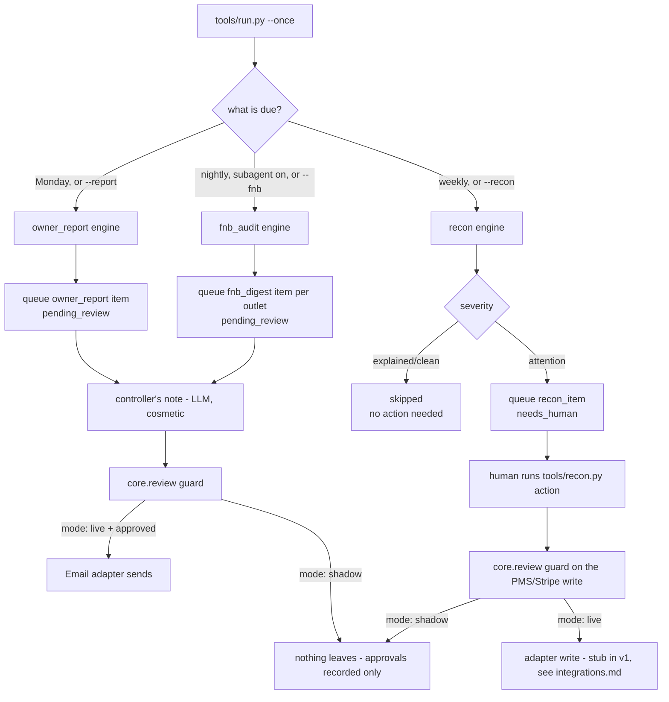

# How Reporting & Audit AI works

Two siblings plus one folded-in sub-agent, all deterministic decisioning with the
LLM used only for one cosmetic line of prose. Nothing here guesses a number.

## The three jobs

| Job | Runs | Reads | Writes (gated) |
|---|---|---|---|
| **Weekly Owner Report** | Monday | `financial_daily` (14 rows), optional web traffic export | a `pending_review` `owner_report` item; "Email to owners" sends it |
| **Weekly Income Audit** (three-way reconciliation) | Weekly | bank statement lines, Stripe payments, PMS folio charges (7-day window) | `recon_item` rows for anything that needs a human; the five action buttons write to PMS/Stripe (all stubs in v1 — see `docs/integrations.md`) |
| **F&B Sales Audit** ("The Pit Boss", sub-agent, off by default) | Nightly, per outlet | `pos_sales_daily`, `pos_items` | a `pending_review` `fnb_digest` item per outlet; "Email to manager" sends it |

Every number the report or the audit shows is arithmetic over real rows. The LLM
is asked for a 3-4 sentence controller's note at the end of a run and nothing
else — see `prompts/finance-note.md`. If that call fails, the run still
completes; the note is just blank. No decision anywhere depends on it.

## Flow

## Modes

- `mode: shadow` (default): every report and digest is drafted and queued;
  every recon action is recorded but nothing reaches the PMS or Stripe.
- `mode: live`: an approved `owner_report` or `fnb_digest` item is emailed when
  a human runs `python3 tools/review.py send` (or `make run` sends automatically
  only for items with autonomy `send` — off by default, see
  `config/agent.example.yaml`). A recon action still needs the item approved
  first (`tools/recon.py action <id> <name>`) — a gate always beats send.

## What runs when

| Workflow | Cadence (default) | Config key | Provider |
|---|---|---|---|
| Weekly Owner Report | Monday, `weekly` | `schedule.owner_report` | LLM only for the controller's note |
| Weekly Income Audit | weekly | `schedule.income_audit` | none (deterministic) |
| F&B Sales Audit (if enabled) | nightly | `schedule.fnb_audit` | LLM only for the controller's note |

`make schedule` reads this block from `config/agent.yaml` and prints the cron /
launchd / systemd snippet — see `workflows/00-setup.md`.

## Data model

A real pass (`make run`, `make watch`) lives in `data/agent.db`, next to the
core `items` table (`core/store.py`). `make demo` runs against its own,
separate database, `data/demo/demo.db` - never `data/agent.db` - so the
bundled fixtures can never mix into, or dedupe against, a hotel's real queue.
See "Idempotency" below and `python3 tools/review.py list --demo` /
`show <id> --demo` to read the demo database. This agent's own tables,
created by `Store.migrate()` in `tools/store_ext.py`:

- `fin_daily` — the ledger the owner report reads: date, four revenue lines,
  five cost lines, occupancy/ADR/RevPAR. A hotel loads it from a CSV export
  (`data/imports/financial_daily.csv`); `tools/run.py` calls
  `store_ext.import_financial_daily_csv()` automatically before every owner
  report pass, so a fresh export is picked up with no separate import step
  (see `docs/integrations.md`).
- `fin_bank_lines`, `fin_stripe_payments`, `fin_pms_charges` — the three
  reconciliation sources, keyed by `day_offset` from the window start so a
  fixture or an export never goes stale relative to "today". Loaded the same
  way, automatically, by `store_ext.import_recon_window_csv()` before every
  income-audit pass.
- `pos_sales_daily`, `pos_items` — the F&B sub-agent's till feed, loaded by
  `store_ext.import_pos_csv()` before every F&B audit pass.
- `fin_runs` — one row per engine run (`kind`: `report` | `recon` | `pos`),
  with a `stats_json` summary and the controller's note. This is what
  `tools/report.py` reads.

The `items` table (core) carries three kinds: `owner_report`, `fnb_digest` and
`recon_item`. `owner_report` and `fnb_digest` are communications — they follow
the ordinary draft -> review -> send path in `tools/review.py`. `recon_item` is
different: there is no message to send, only an action to apply, so it has its
own verb in `tools/recon.py action <id> <name>` instead of `send`. See
"Reusing the review FSM for actions" below.

There is no `fin_recon_actions` table — this agent has no table of its own
for "every action a human pressed." That audit trail lives in the core
`events` table (`core/store.py`), the same one every agent in this family
uses: `tools/recon.py`'s `cmd_action` calls `store.transition()` (which
itself calls `store.record_event()`) for every action, so
`python3 tools/review.py show <id>`'s `events` list is the complete,
timestamped record of who pressed what, in order — nothing is silently lost.

## Idempotency

- `owner_report`: one item per ISO week (`unique_key = period_label`,
  `store.upsert_unique("owner_report", period_label, ...)`). Re-running the
  same week returns the existing item instead of drafting a second one.
- `recon_item`: one item per `(source, external_id)` where `external_id` is a
  stable hash of the finding (e.g. the folio reference, or the bank line id
  for an unmatched credit). Re-running the reconciliation on the same window
  never creates a duplicate exception.
- `fnb_digest`: one item per `(outlet, date)`.
- Nothing increments a sequence or writes an export on a `--dry-run` pass.
- `make demo`'s fixtures never reach the tables above at all - `tools/demo.py`
  opens its own `Store` at `data/demo/demo.db`. Without that isolation, a
  fixture's `owner_report` item would `upsert_unique` under the same
  `period_label` a hotel's first real week produces, and the real report
  would silently return "already drafted this period" instead of drafting.

## Reusing the review FSM for actions

`core/store.py`'s state machine is built for "draft a message, get it
approved, send it." A reconciliation fix (`post_folio`, `refund_duplicate`...)
is not a message, so `tools/recon.py` reuses the same states with a small,
deliberate reinterpretation, documented here so it does not look like a bug:

1. A `recon_item` starts `needs_human` (severity `attention`) or is moved
   straight to `skipped` from `new` (severity `clean`/`explained` — nothing to
   do).
2. `tools/recon.py action <id> <name>` moves it `needs_human -> approved`
   (the human's decision is recorded), then `approved -> sending`, then
   attempts the write — exactly the same claim-then-write shape
   `tools/review.py send` uses for an email.
3. In `mode: shadow` the write is blocked by `core.review` and the item moves
   to `failed`, carrying the guard's own message ("mode is shadow: the
   approval is recorded, but nothing leaves"). `failed -> approved` is a
   legal retry in the core FSM, so re-running the same action once the hotel
   flips to live resumes this exact item — nothing is lost or re-decided.
4. Still in `mode: live`, if the underlying adapter is a stub (v1 default for
   Payments), the attempt raises `AdapterNotImplemented` and the item lands
   on `failed` the same way. Once a hotel wires a real Payments/PMS adapter,
   the human re-runs the same action and it reaches `sent`.
5. For the three log-only actions (`post_fx`, `ask_front_office`,
   `open_dispute`) there is never a write to block — the decision is recorded
   as an event and the item moves straight to `sent`. "Sent" here means "the
   decision is recorded," not "a message went out." The full detail is
   always in `python3 tools/review.py show <id>` (its `events` list).

This keeps every action inside the one write guard the rest of the family
uses, instead of inventing a second permission system for this one agent.

## Design decisions (where the spec was silent or the roster and the built
engine disagreed)

1. **Reconciliation window and sources.** The roster says "PMS reservations
   against the finances sheet ... 120-day window." The actual behavior this
   template is built from is richer: PMS folio charges reconciled against
   **both** Stripe payments **and** the bank statement, over a **7-day**
   rolling window (with pre-window rows dragged back in when a chargeback
   claws them back). This template ships the three-way, 7-day version because
   it is the one with a real matching ladder, payout decomposition and
   duplicate detection behind it. `config/agent.yaml: recon.window_days` is
   there if a hotel wants to widen it; widening it does not turn it into a
   two-way PMS-vs-sheet check, because the matching logic needs all three
   sources.
2. **Web traffic (GA4).** The demo engine that this is built from does not
   include it. This template does: if `data/imports/web_traffic.csv` exists
   (`date, sessions, users`), the owner report adds a one-line traffic
   section with the week-over-week change. If the file is absent, the report
   says plainly that web traffic is not connected yet, instead of silently
   dropping the promise.
3. **ADR and RevPAR are arithmetic means of the daily values**, not
   recomputed from weekly totals (`sum(revenue_rooms) / rooms_sold`). On a
   very uneven week this understates the effect of the strong nights. Carried
   over from the source engine on purpose — recomputing changes the number
   the hotel's finance team already reconciles against elsewhere. Documented
   here so nobody "fixes" it by surprise.
4. **The FX auto-post is never automatic in this template.** The system this
   is built from posts FX rounding differences straight to GL 7620 when the
   tolerance rule is on. That contradicts the hard boundary in the roster's
   own `cant` line — "never edits the books" — so this template always turns
   an in-tolerance FX difference into a `post_fx` action a human presses,
   even though it means one extra click per run. `config/agent.yaml:
   recon.rules.recon-tolerance` still controls whether the difference is
   explained at all, or escalated to `attention`.
5. **F&B flags are not persisted beyond the run's `fin_runs` snapshot.** The
   spec notes `fin_pos_flags` was planned but never built; this template
   keeps that behavior rather than inventing a table the source system does
   not have. A flag has no acknowledge/dismiss lifecycle in v1 — see
   `docs/sub-agents.md`.
6. **No server dimension.** The promise says "by server and by shift"; the
   POS feed this ships with has no server id, so flags are by shift only.
   `docs/integrations.md#pos` shows exactly which column to add to turn this
   on.
7. **A hotel with fewer than 14 days of `fin_daily` history** gets a report
   built on however many days exist, with a note saying the comparison is
   partial, rather than a hard failure — the fixtures always ship 14+ so
   `make demo` shows the full comparison.

8. **No guest-facing text, so no per-message language detection.** The
   family-wide rule is "reply in the guest's own language where the agent
   writes to anyone, else the hotel's default language plus `needs_human`."
   This agent never writes to a guest - every message goes to the owners or
   an outlet manager, generated from structured data, not in reply to a
   guest's own words - so there is no inbound language to detect. Report and
   digest text renders in English in this template. A hotel whose owners
   read another language edits `tools/owner_report.py:render_email_body` and
   the digest body in `tools/run.py:run_fnb_audit`, or asks Claude to
   localize them; `config/hotel.yaml: hotel.languages` still drives
   `knowledge/` and the controller's note.

## Every write, dry-run, and the review FSM

`--dry-run` computes the full result and prints a one-line preview. No
business data is written: no `items` row, no `fin_runs` row, no cursor
update, and the CSV importers (`store_ext.import_financial_daily_csv` /
`import_recon_window_csv` / `import_pos_csv`) are skipped entirely, so
`data/agent.db`'s business tables are byte-for-byte unchanged.
`tools/run.py --once --dry-run` twice on a fresh clone is a no-op both times
- see `test_dry_run_writes_nothing_at_all` in `tests/test_reporting_run.py`.
The one exception is `core.log.Run`'s own `runs` row (started_at/finished_at/
stats), which every tool in this family writes on every pass, dry-run or not
- the run log records a `dry_run` entry there (`stats_json` carries
`"dry_run": true`), which is the audit trail saying a pass was attempted, not
agent data.

## Resumable stages

Only one LLM call exists in this whole agent (the controller's note), and it
is cosmetic and never gates anything, so the "pending interactive stage"
problem `front-desk-ai` had to guard against does not apply here in the same
way. `tools/run.py` still checks `item.draft` (not just `item.intent`) before
deciding a report or digest is "already done," so a run interrupted between
computing the report and writing the note resumes at the note step instead of
re-computing or re-drafting — see `test_reporting_run_resume` in
`tests/test_reporting_run.py`.
